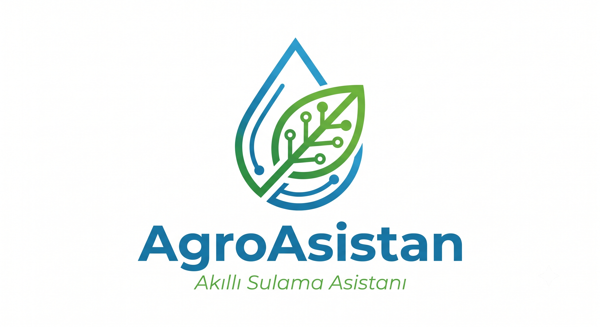
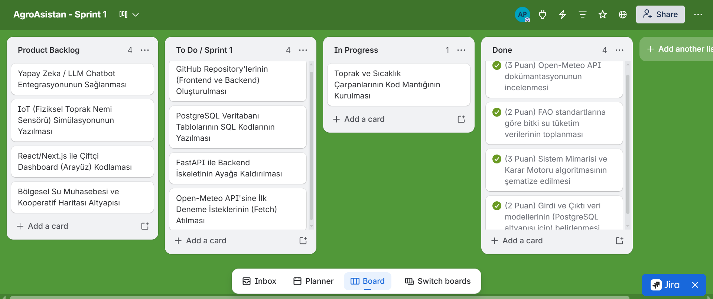
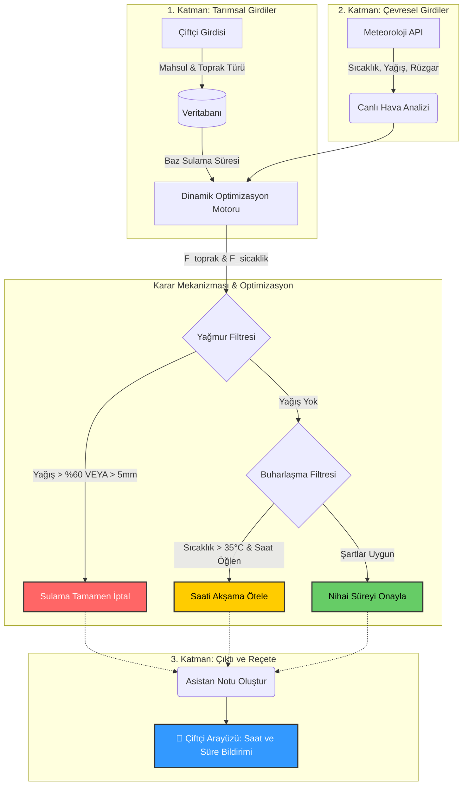
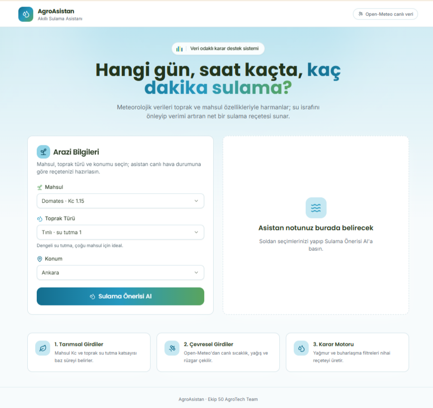

  

**Takım İsmi**
Ekip 50 AgroTech Team

**Takım Üyeleri**
* Atila Paryabbohlouli - Scrum Master / Developer
* Nisa Nur Arslan - Product Owner / Developer 
* Selim Çepni - Developer
* Metehan Kara - Developer
* Eylem Kahveci - Developer

**Proje İsmi**
AgroAsistan (Akıllı Sulama Asistanı)

**Product Backlog URL**

  

**Proje Açıklaması**
AgroAsistan; tarımda su israfını önlemek ve mahsul verimliliğini artırmak için geliştirilmiş, meteorolojik veriler ile toprak/mahsul özelliklerini harmanlayarak çalışan veri odaklı bir dijital karar destek sistemidir. Temel amacı, geleneksel yöntemleri bir kenara bırakarak çiftçiye "Hangi gün, hangi saatte ve kaç dakika" sulama yapması gerektiğini net bir şekilde bildiren akıllı bir danışmanlık hizmeti sunmaktır.

**Proje Özellikleri**
* Full-Stack Web Altyapısı (React, FastAPI, PostgreSQL)
* Dinamik Optimizasyon Motoru (Kural tabanlı karar mekanizması)
* Canlı Hava Durumu API Entegrasyonu (Yağmur ve sıcaklık kontrolü)
* Akıllı Filtreleme Sistemi (Otomatik sulama iptali ve saat erteleme)
* Özelleştirilmiş Çıktı ve Reçete Oluşturma (Çiftçiye anlık bildirimler)

**Hedef Kitle**
* Su tasarrufu ve verimlilik odaklı çiftçiler
* Tarımsal kooperatifler ve bölge yönetimleri
* Sürdürülebilir tarım işletmeleri
* Akıllı tarım teknolojilerine (IoT) entegre olmak isteyen üreticiler

<h1 align="center"> SPRINT 1 </h1>

### 1. Product Backlog (Ürün İş Listesi)

Henüz aktif kodlama aşamasına geçilmediği için bu sprintte ana odağımız "Sistem Tasarımı, Mimari Planlama ve Veritabanı Modellemesi" olmuştur. Backlog'umuzda kod taskları yerine; sistemin gereksinim analizi, meteoroloji API'lerinin araştırılması, karar algoritmasının matematiksel modellenmesi ve arayüz taslaklarının oluşturulması gibi maddeler yer aldı. Süreci Trello üzerinden yönettik.

* **Ekran Görüntüsü:**
    

  

### 2. Sprint Puanlaması (Sprint Scoring)

Projemizin yönetim kuralları gereği, bu sprintteki görev değerlendirmeleri sabit puan mantığına göre işletilmiştir.

* **Puanlama Mantığı:** İlk sprint içi hedef puan değerlendirmesi 10 puan olarak belirlenmiştir. Projenin genelinde tamamlanması gereken toplam backlog puan havuzu ise 36'dır.
* **Ne Kadarı Tamamlandı?:** Henüz kodlama aşamasına geçilmemiş olsa da; fikir netleştirme, sistem mimarisi tasarımı, API araştırmaları ve girdi/çıktı veri modellerinin kararlaştırılması adımları tamamlanmıştır. İlk sprint için bitirilmesi istenen 10 puanlık hedefin tamamına (%100 başarı oranı ile) ulaşılmıştır. Toplam 36 puanlık proje hedeflerinin 10 puanı başarıyla kapatılmıştır.

### 3. Daily Scrum (Günlük Toplantılar)

**21 Haziran 2026**
Ekip bir araya gelerek projenin birbirini etkileyen 3 temel veri katmanını (tarımsal girdiler, çevresel girdiler ve çıktı) netleştirdi. Sistem mimarisi üzerine fikir birliğine varıldı ve araştırma görevlerinin takımdaki dağılımı yapıldı.

**27 Haziran 2026**
Çevresel veriler için canlı hava durumu API alternatifleri (Open-Meteo) araştırıldı. Tarımsal veriler için FAO standartlarındaki bitki su tüketim katsayıları ve toprak türlerinin (kumlu, killi, tınlı) su tutma kapasiteleri üzerine veri toplama süreci tamamlandı.

**1 Temmuz 2026**
Karar motorunun (Decision Engine) algoritma mantığı ve UI (arayüz) taslakları oluşturuldu. Yağmur ve buharlaşma filtrelerinin anlık sıcaklığa ve beklenen yağış miktarına göre sistemi nasıl kilitleyeceği veya erteleyeceği karara bağlandı.

**5 Temmuz 2026**
Sprint 1 sona ererken projenin temel altyapı tasarımı ve girdi/çıktı veri modelleri büyük ölçüde netleşti. İlk sprint için hedeflenen 10 puanlık planlama aşaması tamamlandı ve sprint sonu gerekli README dosyasında hazırlandı.

### 4. Ürün Geliştirme Durumu (Product Status)

Henüz çalışan bir kod parçası veya son kullanıcı arayüzü (UI) bulunmamaktadır. Ancak bu sprintin en büyük somut çıktısı, projemizin **Sistem Mimarisi Diyagramı** ve kullanıcı senaryolarının (wireframe) oluşturulmasıdır.Çiftçinin sisteme nasıl girdi sağlayacağı ve sistemin arka planda hangi süzgeçlerden geçerek sonuç üreteceği görselleştirilmiştir.

    

### 5. Sprint Review (Sprint İncelemesi)

Bu sprint boyunca kod yazımına başlamadan önceki tüm kritik kararları aldık:
* **API Seçimi:** 2. Katman olan çevresel verileri çekmek için harici servislerden yararlanılmasına karar verildi.
* **Veri Modelleri:** Çiftçi, Arazi ve Mahsul türlerinin parametreleri netleştirildi.FAO standartlarındaki "Bitki Su Tüketim Katsayısı"nın girdi olarak kullanılması kararlaştırıldı.
* **Karar Motoru Kriterleri:** Toprak türü (kumlu, killi vb.) ve hava sıcaklığı için sulama süresini değiştirecek matematiksel çarpanların sınırları ve kuralları belirlendi. 
* **Teknoloji Yığını (Tech Stack):** Projenin Frontend (React) ve Backend (FastAPI) dillerine karar verildi.

### 6. Sprint Retrospective (Sprint Değerlendirmesi)

* **Neyi İyileştirmemiz Gerekiyor?:** Karar verme aşamasında meteoroloji API'lerinin belgelerini incelerken ve matematiksel modeli kurarken öngördüğümüzden fazla zaman kaybettik. Bir sonraki sprintte teknik analizlere süre sınırı (time-boxing) koymamız gerekiyor.
* **Gelecek Sprint Planı (Neyi Farklı Yapacağız?):** Fikir ve mimari tasarım aşaması (Sprint 1) başarıyla tamamlandığı için bir sonraki sprintte doğrudan **kodlama ve altyapı kurulumuna** geçeceğiz.
* **Yeni Planların Özeti:** React ve FastAPI projelerinin iskelet yapıları (boilerplate) ayağa kaldırılacak, GitHub repository'lerine ilk taahhütler (commit) yapılacak.

<h1 align="center">⚡ SPRINT 2 ⚡</h1>
### Sprint 2 İçinde Tamamlanması Tahmin Edilen Puan: 10 Puan

### 1. Daily Scrum:
Daily Scrum toplantıları Whatsapp üzerinden devam etmiştir. haftada birkaç gün toplantılar yapılarak API entegrasyonu ve veritabanı mimarisi tartışılmıştır. Whatsapp üzerinden projenin veri modelleri ve JSON çıktı dili oturtulmuştur. Günlük olarak FastAPI arka uç yazılımları, hata yönetimi (try-except) blokları ve kural tabanlı algoritmalar kodlanmıştır.

**Geliştirici Whatsapp Grubu Mantığı:** 
Grup içerisinde API uç noktalarının (endpoints) ve karar motorunun (Decision Engine) matematiksel sınırları tamamen oturtulmuştur. Bir sonraki sprintte yapılacak Frontend (arayüz) geliştirme süreci için veri aktarım (JSON) dili hazır hale getirilmiştir.

**Sprint 2 Board Update:** 

**📋 Güncel Proje Panosu (Agile Board)**

| 📌 Product Backlog (Gelecek Vizyonu) | 📝 To Do (Sıradaki İşler) | ⏳ In Progress (Devam Edenler) | ✅ Done (Bitenler) |
| :--- | :--- | :--- | :--- |
| Yapay Zeka / LLM Chatbot Entegrasyonunun Sağlanması | Alembic Kurulumu ile Veritabanı Göç (Migration) Yönetimi | Frontend ve Backend Uçtan Uca (E2E) Testleri | **(3 Puan)** FastAPI ile Arka Uç İskeleti ve API Uç Noktaları |
| IoT (Fiziksel Toprak Nemi Sensörü) Simülasyonunun Yazılması | JWT Tabanlı Çiftçi Kullanıcı Girişi (Authentication) Yapısının Kurulması | | **(3 Puan)** PostgreSQL Veritabanı Modelleri (SQLAlchemy) |
| Bölgesel Su Muhasebesi ve Kooperatif Haritası Altyapısı | | | **(2 Puan)** Open-Meteo API Entegrasyonu ve Hata Yönetimi |
| | | | **(2 Puan)** Karar Motoru (Fuzzy Logic) Çarpanlarının Kodlanması |
| | | | **(Ekstra Başarı)** React ile Çiftçi Kontrol Paneli (Frontend) Geliştirmesi |

**Ürün Durumu:** 

*Ekran Görüntüleri:*

  

### Sprint Review:
Sprint 2'nin sonunda ekip ile toplanılmış ve Sprint gözden geçirilmiştir. Planlanan mimari başarıyla koda dökülmüş, arka uç (backend) sistemi istenilen amaçlara ulaşmıştır. Karar algoritması (Yağmur ve Buharlaşma filtreleri) ile API hata yönetimi sisteme entegre edilerek aktif hale getirilmiştir.

### Sprint Retrospective:
* Sprint 2 için planlanan ve alınan puan 10'dur. Veritabanında profesyonel tablo güncellemeleri yapabilmek için Alembic (migration) sistemini çözmek diğer sprint'e kalmıştır.
* Takım üyelerinin gelecek sprintlerde Frontend (React/Ön yüz) tarafında daha aktif olması gerektiğine vurgu yapılmıştır.
* Arka uç veri modelleri ve dış meteoroloji servisleri (Open-Meteo) ile ilgili görevler tamamlanmış, daha az iş kaldığı için ağırlıklı olarak kullanıcı arayüzü (Dashboard) inşası kısmına el atılması gerektiğine karar kılınmıştır.
* Karar motorunun optimizasyon çarpanları ve API hata yönetim (Fallback) mekanikleri entegre edilmiştir.
* Arka uç (Backend) kodlaması bitmiş, sistemin React Frontend ile bağlanması için gerekli JSON şemaları not alınmıştır.
* Çiftçi kontrol paneli (Frontend) tasarımına başlanılmış, arayüz taslağı (wireframe) hazırlanmıştır.